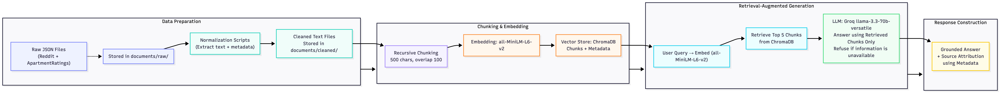

# Project 1 Planning: The Unofficial Guide

> Write this document before you write any pipeline code.
> Your spec and architecture diagram are what you'll use to direct AI tools (Claude, Copilot, etc.) to generate your implementation — the more specific they are, the more useful the generated code will be.
> Update the Retrieval Approach and Chunking Strategy sections if you change your approach during implementation.
> Update this file before starting any stretch features.

---

## Domain

**Off-Campus Housing Experiences Near Arizona State University (Tempe Campus)**

This project focuses on off-campus housing experiences near Arizona State University's Tempe campus. Students searching for housing often need information about apartment quality, management responsiveness, maintenance issues, safety concerns, noise levels, commute convenience, and overall value for money. While apartment websites primarily advertise amenities and pricing, real resident experiences are scattered across review platforms and online discussions, making it difficult for students to efficiently compare housing options and make informed decisions. This system aims to make those unofficial experiences searchable through a single question-answering interface.

---

## Documents

| # | Source | Description | URL or location |
|---|--------|-------------|-----------------|
| 1 | IMT Desert Palm Village Reviews | ApartmentRatings reviews discussing resident experiences, management quality, maintenance, safety, and amenities. | https://www.apartmentratings.com/az/tempe/imt-desert-palm-village_480968109985281/#ratingsReviews  |
| 2 | Murietta at ASU Reviews | ApartmentRatings reviews covering maintenance issues, safety concerns, management interactions, and overall resident satisfaction. | https://www.apartmentratings.com/az/tempe/murietta-at-asu_85281/#ratingsReviews |
| 3 | Paseo on University Reviews | ApartmentRatings reviews describing apartment conditions, noise levels, management responsiveness, and resident experiences. | https://www.apartmentratings.com/az/tempe/paseo-on-university_4809688118852818420/#ratingsReviews |
| 4 | Onnix Reviews | ApartmentRatings reviews discussing amenities, maintenance quality, leasing experiences, and resident feedback. | https://www.apartmentratings.com/az/tempe/onnix_9199332346275174870/#ratingsReviews |
| 5 | Sentry Tempe Reviews | ApartmentRatings reviews highlighting safety, maintenance, management, pricing, and overall housing experiences. | https://www.apartmentratings.com/az/tempe/sentry-tempe_4808942261852824945/ |
| 6 | Apartments to Avoid | Reddit discussion where ASU students share apartments they recommend avoiding and explain common issues. | https://www.reddit.com/r/ASU/comments/13vclht/apartments_to_avoid/ |
| 7 | What Apartments Are Good in Tempe Near ASU? | Reddit discussion containing apartment recommendations and comparisons from current and former students. | https://www.reddit.com/r/ASU/comments/1np68lm/what_apartments_are_good_in_tempe_near_asu/ |
| 8 | Cheap Apartments Near ASU Tempe Recommendations | Reddit discussion focused on affordable housing options, pricing, and value for money near campus. | https://www.reddit.com/r/ASU/comments/1d6osqa/cheap_apartments_near_asu_tempe_recommendations/ |
| 9 | Apartments Near ASU | Reddit discussion covering general housing recommendations, apartment experiences, and location considerations. | https://www.reddit.com/r/ASU/comments/11efwke/apartments_near_asu/ |
| 10 | Off-Campus Apartments | Reddit discussion about off-campus housing options, apartment comparisons, and student experiences living near ASU. | https://www.reddit.com/r/ASU/comments/y6pbzt/offcampus_apartments/ |

---

## Chunking Strategy

**Chunk size:** 500 characters

**Overlap:** 100 characters

**Reasoning:**
My documents contain a mix of ApartmentRatings reviews and Reddit discussions. Some reviews are only one or two sentences long, while others are several paragraphs and cover multiple topics such as safety, maintenance, management, and pricing.

I plan to use a recursive chunking strategy so that shorter reviews and comments stay intact whenever possible. Short reviews and comments will remain as a single chunk whenever possible, while longer reviews will be split at natural boundaries such as paragraphs or sentences before falling back to character-based splitting. I chose a chunk size of 500 characters because it is usually large enough to keep a complete recommendation or complaint together, while still being small enough for accurate retrieval. I will use an overlap of 100 characters so that important details are less likely to be lost when a long review is split across multiple chunks.

---

## Retrieval Approach

**Embedding model:** all-MiniLM-L6-v2 (sentence-transformers)

**Top-k:** 5

**Implementation note:**
During implementation, I found that apartment-specific queries sometimes retrieved reviews from other apartment communities because management, maintenance, and safety complaints use similar language across many properties. To improve retrieval quality, I implemented a two-stage retrieval process. The system first retrieves the top 10 semantic matches from ChromaDB, then applies property-aware reranking when the query explicitly mentions an apartment name. Chunks from the matching apartment are prioritized, while semantic retrieval remains unchanged for broader queries. The final system still returns the top 5 results.

**Production tradeoff reflection:**
For this project, I will use all-MiniLM-L6-v2 because it is free, runs locally, and is fast enough for a small RAG system. I chose a top-k value of 5 because it should provide enough context from multiple reviews and discussions without introducing too much unrelated information. If I were deploying this system for real users and cost was not a constraint, I would consider larger embedding models that may provide better retrieval accuracy, especially for longer reviews and more complex housing-related queries. I would also consider latency, since larger models are often slower, and multilingual support if the system needed to handle reviews written in languages other than English. Since all of my current documents are in English, multilingual support is not a requirement for this project.

---

## Evaluation Plan

| # | Question | Expected answer |
|---|----------|-----------------|
| 1 | What concerns do residents raise about management at Sentry Tempe? | Residents describe poor communication, ignored complaints, slow responses, unresolved maintenance requests, and a lack of urgency in addressing resident concerns. |
| 2 | Why do multiple residents recommend avoiding Paseo on University? | Residents mention frequent water shutoffs, roach infestations, maintenance problems, plumbing issues, noisy neighbors, safety concerns, and poor communication from management. |
| 3 | What positive experiences do residents mention about IMT Desert Palm Village? | Residents frequently praise the maintenance team for quick responses, helpful leasing staff, smooth move-in experiences, affordability, and friendly customer service. |
| 4 | What complaints are mentioned about Onnix? | Residents report slow maintenance, pest problems, parking issues, water shutoffs, trash problems, high costs, and poor communication from management. |
| 5 | What is the average rent for a one-bedroom apartment in downtown Phoenix? | The system should indicate that it does not have enough information because the collected documents focus on apartment reviews and housing experiences near ASU Tempe, not rental market statistics for downtown Phoenix. |

---

## Anticipated Challenges

1. **Challenge 1: Conflicting Opinions** - Apartment reviews and Reddit discussions are highly subjective. One resident may describe an apartment as quiet and safe, while another may describe the same apartment as noisy and unsafe. This could make it difficult for the system to provide a clear answer when the retrieved chunks contain conflicting experiences from different residents.

2. **Challenge 2: Long Reviews Cover Multiple Topics** - Many ApartmentRatings reviews discuss several topics in a single review, such as maintenance, safety, management, pricing, and amenities. If a long review is split into multiple chunks, important context could be separated across chunk boundaries, causing retrieval to return only part of a resident's experience and leading to incomplete answers.

---

## Architecture

**Metadata stored with each chunk:**
- source_platform
- document_title
- source_url
- apartment_name (optional)
- chunk_index
- record_type
- rating (optional)

---

## AI Tool Plan

**Milestone 3 — Ingestion and chunking:**

I plan to use Claude Code to help build the cleaning and chunking scripts. I will give it my Documents section, Chunking Strategy section, and the pipeline diagram so it knows what file types I have and how I want the text to be processed. I expect it to produce scripts that load the raw JSON/text files, clean the content, and split it into chunks using my chosen chunk size and overlap. I will verify the output by printing cleaned documents and a few sample chunks to make sure the text still reads naturally and that reviews/comments are not getting broken in awkward places.

**Milestone 4 — Embedding and retrieval:**

I plan to use Claude Code to implement the embedding and retrieval part of the pipeline. I will give it my Retrieval Approach section, Chunking Strategy section, and Architecture diagram so it can connect the cleaned chunks to the vector store correctly. I expect it to produce code that embeds the chunks with all-MiniLM-L6-v2, stores them in ChromaDB with source metadata, and returns the top-k most relevant chunks for a query. I will verify this by testing a few evaluation questions and checking whether the retrieved chunks are actually relevant and come from the right sources.

**Milestone 5 — Generation and interface:**

I plan to use Claude Code to wire retrieval into the LLM and build the query interface. I will give it my Retrieval Approach section, Anticipated Challenges, and Architecture diagram, along with my grounding requirement that answers must come only from retrieved context. I expect it to produce a working end-to-end query flow that retrieves chunks, sends them to the model, and returns an answer with source attribution. I will verify the output by asking questions that are clearly covered by the documents, checking that the response cites the correct sources, and also asking at least one out-of-scope question to make sure the system refuses instead of guessing.
